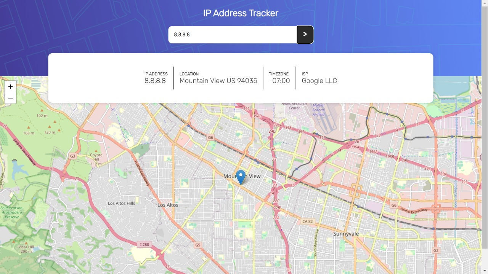

# Ip-address-tracker
## Table of contents

- [Overview](#overview)
  - [The challenge](#the-challenge)
  - [Screenshot](#screenshot)
  - [Links](#links)
  - [Built with](#built-with)
- [Author](#author)

## Overview

This app tracks the address of the entered IP address. It was made using leafletJS (https://leafletjs.com/) and IP Geolocation API by IPify (https://geo.ipify.org/)
⚠️ **IMPORTANT** ⚠️: To use the IP Geolocation API by IPify, you'll need to sign up for a free account. You won't need to add any cards details to do this and it's a very quick process. This will generate an API Key for you. Usually, you would be able to restrict your API Key to a specific URL (your own domain). This makes sure that other people can't use your API Key on their own websites. IPify doesn't have this feature, but because you aren't adding your card details, this isn't an issue. **So be sure to only sign up for the free account and DO NOT enter any card details**.

### The challenge

Users should be able to:
Enter an IP address and track it's location

### Screenshot

### Links

- Solution URL: 
- Live Site URL: 

### Built with

- HTML
- CSS
- JavaScript
- API

## Author

Aryan Agarwal
From Frontend Mentor
